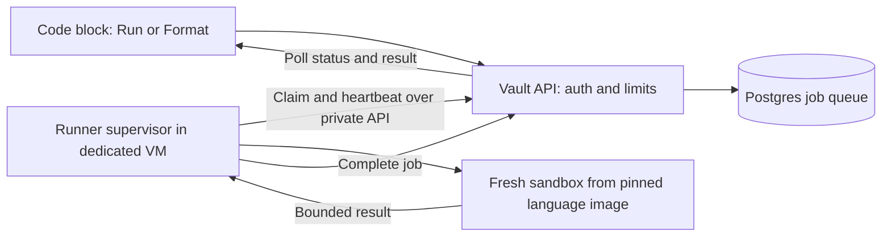

# Code Blocks: Highlighting, Formatting, and Execution

Status as of 2026-09-25:

- §4 (highlighting and block controls) and §5's browser half are **implemented
  and browser-verified**, plus a fence language picker that is not in the
  original slice list.
- §6's host and backend questions are **decided** (gVisor on the host, OCI only
  — see the §6 note), and the `runner/` proof has been run on the mini-PC.
  Isolation passes 12/12; six languages run; measured timings are in §6.1.
- **C# execution and CSharpier are dropped** (see §1). Six languages, not seven.
- **§7's job API and storage are implemented** (slice 4, 2026-09-25): `code_jobs`,
  the `/api/code/*` routes, and `runner/worker.mjs`. Python and JavaScript run end
  to end from the editor. Verified locally under plain `runc`; **not yet deployed
  to the mini-PC or run under gVisor.**
- **Slice 5 is implemented** (2026-09-25): Java, Haskell, C and C++ profiles,
  the native formatters behind **Format**, and a private stdin box. Also
  verified only locally under `runc`. One departure from §8: Java runs with a
  10s limit, not 5s, because the deadline includes sandbox start and a cold JVM
  exceeded 5s.
- Still proposal only: multiple workers, and the spare-sandbox and compilation
  cache optimizations in §9.

Tracked as Phase 24 (plan numbers and tracker phase numbers differ); see
`docs/01_PROGRESS_TRACKER.md` for which slice is where, and
`docs/project-knowledge.md` for what the code actually does.

## 1. Product direction

Make ordinary Markdown fences useful for writing and running code:

````md
```python
print("Hello from Vault")
```
````

The opening fence's first word selects the language. Highlight automatically;
rewrite source only when the author clicks **Format**; execute only when they
click **Run**. An HTML fence displays HTML source, not a rendered web page.

User-confirmed scope: syntax highlighting **and an explicit Format button**,
then robust server-side execution for Python, JavaScript, Java, Haskell, C,
and C++.

**C# execution and CSharpier formatting were dropped on 2026-09-24**, after the
slice 3 proof. C# is the only language in the set that cannot compile a loose
file: the SDK needs a project, so it needs a host-owned template copied into
each job, made writable, its stale `obj/`/`bin/` discarded, and an offline
restore performed. It failed three proof runs for three unrelated reasons in
that scaffold — read-only copied sources, a NuGet folder that a package-less
template never creates, and a formatter whose command name changed across
versions — while the other six languages worked once two shared bugs were
fixed. The cost was concentrated entirely in the scaffold rather than in the
language, which is what made it the right thing to cut. **C# remains fully
supported for highlighting**; only running and server-side formatting are gone.
Revisit by pinning an SDK image that ships a prebuilt writable project, not by
retrying the copy-and-patch approach.

Expect one user initially, but support more workers without changing the editor
or job API. Browser-only JavaScript is not the execution architecture for this
scope.

Highlighting and formatting are core code-block features. Execution is an
optional trusted built-in capability, disabled unless the deployment enables
it. A document must remain readable without any runner service.

## 2. Current implementation and integration points

- `MarkdownDocument.tsx` already renders fences using `pre` and `code`
  overrides, but has no syntax-highlighting transform.
- `MarkdownEditor.tsx` configures CodeMirror Markdown with HTML support but no
  `codeLanguages`. Several theme selectors override token colors; adding
  grammars alone will not produce reliable Live-mode highlighting.
- Live code fences currently use line decorations and line-based fence scans
  (`getCodeFenceLines`, `codeFenceBlockRange`). Do not reuse the simplistic
  fence toggle scan as the authority for destructive formatting or execution.
- `live-blocks.ts` already recognizes CodeMirror `FencedCode`/`CodeBlock` nodes
  to keep other widgets out of code. Preserve that exclusion.
- Rendering runs `rehype-raw`, `rehype-sanitize`, `rehypeSanitizeContent`, then
  KaTeX. `lib/html-class.ts` allows language hints but strips arbitrary classes.
- `.vault-md-pre` and `.vault-md-code` are stable public CSS hooks.
- Markdown remains the stored content; edits flow through CodeMirror/Y.Text.
  Formatting must use that path, never a direct database body overwrite.
- Production currently has web, Postgres, and collaboration services. No
  execution worker, runtime images, execution queue, or execution tables exist.

## 3. One language catalog, separate capabilities

Define a typed catalog with canonical ID, aliases, display name, grammar
loaders, formatting capability, and available runtime profile IDs. Keep
server-only image digests, commands, resource policies, and credentials in a
separate server registry. A fence string never becomes a command or image name.

| Language | Fence aliases | Proposed formatter | Proposed execution profile |
|---|---|---|---|
| Python | `python`, `py`, `python3` | Ruff | CPython, `main.py` |
| JavaScript | `javascript`, `js` | Prettier | Node.js, `main.mjs` |
| Java | `java` | google-java-format | JDK: compile `Main.java`, run `Main` |
| Haskell | `haskell`, `hs` | Ormolu | GHC: compile `Main.hs`, run binary |
| C | `c` | clang-format | GCC or Clang: compile `main.c`, run binary |
| C++ | `cpp`, `c++`, `cxx` | clang-format | GCC or Clang: compile `main.cpp`, run binary |
| C# | `csharp`, `cs`, `c#` | *(dropped 2026-09-24)* | *(dropped 2026-09-24 — see below)* |

Also highlight common documentation languages: TS/TSX/JSX, JSON, HTML, CSS,
SQL, YAML, Bash, and Markdown. Execution is enabled only for profiles actually
installed and verified; highlighting does not imply an executable runtime.
Unknown/empty language and `text`/`txt` remain readable plain code.

Runtime profiles specify exact compiler/runtime versions, language standards,
fixed entrypoints, image digests, and limits. Show the selected runtime version
in the execution UI and record it with every result. Choose supported versions
when building images; do not copy old versions from execution-service examples.

Formatter references: [Prettier](https://prettier.io/docs/browser),
[Ruff](https://docs.astral.sh/ruff/formatter/),
[google-java-format](https://github.com/google/google-java-format),
[Ormolu](https://github.com/tweag/ormolu),
and [clang-format](https://clang.llvm.org/docs/ClangFormat.html).
[CSharpier](https://csharpier.com/docs/About) is no longer in scope.

## 4. Highlighting and block controls

1. Use CodeMirror's fenced-language configuration for editable source, loading
   only registered grammars. Normalize aliases consistently with the renderer.
2. Prefer `rehype-highlight` with explicitly registered grammars and language
   autodetection disabled for Read/public/embedded content. Bound source size
   and fall back to plain code for oversized blocks or highlighting errors.
3. Apply trusted highlighting after both existing sanitizer passes, to text
   inside code nodes only. Preserve KaTeX behavior. Do not broaden authored HTML
   class/style permissions to accommodate generated token markup.
4. Scope token styles to code blocks using Vault theme tokens. Preserve existing
   CSS hooks; document any new stable hooks in `CSS_CONTRACT.md` when shipped.
5. Provide a compact language label and **Copy**; editable documents also have
   **Format**. **Run**, **Stop**, stdin, and the result panel arrive with execution.
6. Keep code editable/selectable in Live mode. Prefer decorations and a
   selection-aware toolbar over replacing every fence with another editor.
   Controls must not disrupt cursor movement, text selection, or collaboration.

Use parser-derived fence/body ranges, accounting for backtick and tilde fences,
longer fences, list/blockquote nesting, and unfinished fences while typing.
Never identify a block only by its ordinal index. Malformed/unclosed fences can
be displayed, but Format/Run require an unambiguous complete target.

Validate the shared renderer on Read, public/share, official docs, transclusions,
and the rendered-HTML embed API. Interactive controls may progressively enhance
HTML; server-rendered code must remain useful without JavaScript.

Sources: [CodeMirror Markdown](https://github.com/codemirror/lang-markdown),
[rehype-highlight](https://github.com/rehypejs/rehype-highlight), and
[sanitizer/highlighter ordering](https://github.com/rehypejs/rehype-sanitize).

## 5. Explicit formatting

- First ship browser formatting for JS/TS/JSX/TSX, JSON, HTML, CSS, and YAML with
  lazy-loaded Prettier standalone and explicit bundled parser plugins. Run it
  in a terminable worker to protect editor responsiveness; no third-party API.
- Add native language formatters through the same isolated job service used
  later for execution, with `operation: format`. Python/Java/Haskell/C/C++/C#
  need working adapters before the full multi-language release is complete.
- Use pinned, host-owned formatter settings. Never load user-provided plugins,
  project configuration, package scripts, build hooks, or remote dependencies.
- Format only the body, preserving language spelling, fence metadata and the
  surrounding document. Preserve/reapply Markdown container indentation; reject
  ambiguous mappings. If generated text could close the fence, lengthen both
  delimiters safely in the same transaction or reject the edit.
- Capture body, language, and mapped range before the async request. Revalidate
  them against current CodeMirror state on return. If the target was edited,
  deleted, or ambiguously remapped, offer retry rather than replacing new text.
- Apply the change as one undoable CodeMirror/Y.Text transaction, preserving
  sensible cursor placement. Do not autoformat on save or during typing.
- Parse errors, timeouts, and unsupported formatters leave source unchanged.
  Format does not repair incomplete programs or add missing entrypoints.

## 6. Execution architecture

**Decided 2026-09-24, superseding the recommendation below**: gVisor runs
directly on the mini-PC as an additional Docker runtime, not inside a dedicated
VM. The host already shares 16 GB between web, collab, Postgres and the CI
runner, and per-job `runsc` sandboxes provide the isolation either way; the VM
only added administrative separation. Accepted tradeoff: a sandbox escape
reaches the same host as Postgres and `.env.production`, which is acceptable
for a single-operator deployment and should be revisited if the runner is ever
exposed to untrusted users. Also decided: only the OCI + gVisor backend is
evaluated — Piston and Judge0 address neither the five native formatters nor
the per-language images slice 4 needs. The proof harness lives in `runner/`.

Original recommendation: a dedicated Linux runner VM, initially on the same
mini-PC if capacity permits. Its supervisor creates disposable language
containers using a sandboxed OCI runtime such as gVisor `runsc`. The VM separates
runner administration from Vault's application services; per-job sandboxes
isolate individual executions. Prove runtime compatibility on the actual host.



Keep cached images per toolchain, not a permanently running container per user
or language. Each job gets a clean writable workspace and process tree, then
is destroyed. Compilation and execution may share that job's workspace but
have independent limits. Compilation is untrusted too: macros and compiler
features can execute code before the program's run stage.

Start with an ordinary durable Postgres queue, avoiding a new Redis dependency.
Claim jobs atomically using row locking, with leases and heartbeat renewal.
The trusted API owns database access; runner machines receive only assigned
job payloads through authenticated private claim/heartbeat/result endpoints.
They never receive Vault database, OAuth, or R2 credentials.

The runner adapter contract covers capabilities, start, status/result, cancel,
and cleanup. Keep it independent of UI and persistence. Benchmark a thin OCI
adapter against existing engines before committing to backend implementation:

| Backend | Fit and tradeoff |
|---|---|
| Sandboxed OCI containers | Preferred fit for explicit per-language images and native formatters; requires maintaining the supervisor, images, and lifecycle tests |
| Self-hosted Piston | Existing multi-language compile/run engine; may reduce adapter work, but verify cancellation, limits, toolchain freshness, and its privileged deployment inside the dedicated VM |
| Self-hosted Judge0 | Existing submissions/resource-limit API; evaluate if its broader service stack saves enough work to justify operating it |

Do not assume Piston/Judge0 use gVisor, or that their documented defaults meet
Vault's policy. An alternative adapter must pass the same isolation and cleanup
tests. Do not rely on a public execution API for private document source.

Sources: [gVisor architecture](https://gvisor.dev/docs/),
[Piston](https://github.com/engineer-man/piston),
[Judge0 API](https://ce.judge0.com/).

## 6.1 Measured on the mini-PC (2026-09-24)

Host: Intel N150, 4 efficiency cores, 16 GB, Ubuntu 24.04, Docker 29.2,
gVisor `release-20260921.0`. Measured with the Minecraft server stopped, which
is the realistic condition — Vault and the modpack are rarely used together.
Load average ~1.1, 13 GB free. Timings are wall time for the whole sandboxed
job: container start, compile where applicable, run, and teardown.

| Language | Cold | Warm | Notes |
|---|---:|---:|---|
| Python | 267ms | **254ms** | interpreted |
| JavaScript | 632ms | **302ms** | interpreted |
| C | 548ms | **344ms** | gcc 14 |
| C++ | 1029ms | **829ms** | gcc 14 |
| Haskell | 2556ms | **1382ms** | GHC 9.6 |
| Java | 2826ms | **2747ms** | Temurin 21 |

Images total **6.48 GB** against 312 GB free, so disk is not a constraint.
Haskell is 3.12 GB of that — 56% of the total for one language.

**Isolation: 12/12.** Outbound network denied, DNS unavailable, root filesystem
read-only, workspace writable, job unprivileged, no-new-privileges set, fork
bomb capped by the pid limit, memory hog killed, runaway loop killed by the
timeout, `uname` reports gVisor rather than the host kernel, a running job can
be killed mid-execution, and no container survives the job.

**Conclusions.**

- The host is viable. Sandbox overhead is modest and four of six languages are
  under a second warm, so Run can use a plain spinner for those rather than a
  queued/running UI. Java at 2.7s is the one users will feel.
- Haskell was expected to be the casualty and was not: at 1382ms it is faster
  than Java. Its only real cost is image size.
- gVisor's isolation properties hold on this kernel, which is the precondition
  slice 4 depends on.
- Contention with the Minecraft server is untested. The measured numbers assume
  it is stopped. If both must run at once, re-measure before promising latency.

## 7. Job API, persistence, and permissions

Proposed user endpoints:

- `GET /api/code/capabilities`: available formatters and runtime profiles.
- `POST /api/code/jobs`: document ID, operation, canonical language/profile,
  current block source snapshot, stdin, and client request ID; returns `202`
  and a job ID promptly. No request waits for a compiler to finish.
- `GET /api/code/jobs/[id]`: state and bounded result, initially using polling.
- `POST /api/code/jobs/[id]/cancel`: idempotent cancellation.

The submitted source is the current editor snapshot, which may be newer than
the database's debounced save. Treat it as arbitrary user input; the document
ID authorizes the feature, not a claim that the source was already persisted.
Record source hash/profile/operation/stdin identity for reproducible association.
Output is marked stale if the block changes after submission.

Proposed `code_jobs` storage: job/user/document IDs; operation and runtime
profile/digest; source snapshot and stdin; source hash; bounded result including
separate compiler diagnostics/stdout/stderr, exit status/signal and timings;
state; request ID; worker/attempt ID, lease expiry and heartbeat; timestamps;
cancel request and retention expiry. Index claimable jobs and user histories;
enforce request-ID uniqueness per user. Add migration and update data-model docs
only when this slice is implemented. Source/stdin/output are private data.

Lifecycle: `queued -> preparing -> compiling -> running -> succeeded` with
terminal `compile_error`, `runtime_error`, `timed_out`, `resource_limit`,
`output_limit`, `cancelled`, and `infrastructure_error`. Format jobs use
`formatting` instead of compile/run. Omit irrelevant stages for interpreted code.

Authenticate an active user and check `getDocumentAccess(...).canEdit` on
submission, then recheck before dispatch. Also require a per-user execution
grant (`users.code_execution_allowed`, set by an admin in Admin → Users;
until 2026-09-25 this was the `CODE_EXECUTION_USER_IDS` env list). Editing a
document alone does not grant access to compute. Owners/editors can use the
feature once granted; viewers and anonymous readers cannot submit jobs.

Result reads/cancellation require the submitting user plus current document
access; inaccessible resources return 404. Recheck bans/revocation. Worker
credentials only claim eligible jobs and report on their own current leases;
user cookies cannot call worker endpoints. Protect cookie-authenticated
mutations against cross-site requests and bound/rate-limit each API.

Results are private to the submitting user, expire after a proposed 24 hours,
and never automatically enter Markdown, collaboration, public pages, or MCP.
Render stdout/stderr as inert text, not HTML, Markdown, or terminal escapes.
Publishing output would be a later explicit authoring action.

## 8. Isolation and resource policy

Enforce these for formatting, compilation, and execution:

- No network in job sandboxes, including DNS, loopback services outside the
  sandbox, cloud metadata, and the home LAN. Test this; disabling `fetch` is
  not a network boundary. The supervisor has only its required private API path.
- Read-only toolchain image, unprivileged job user, dropped capabilities,
  restricted syscalls, no host PID namespace, no device or Docker-socket mounts,
  and no application volumes or secrets. Only a bounded per-job workspace is
  writable. Privileged orchestration, if needed, stays outside the workload.
- Fixed executable/argument arrays chosen by runtime profile. No user shell
  command, image name, compiler flags, `.csproj`, Makefile, or package scripts.
- Bound source/stdin bytes, wall time, CPU, memory, process count, disk/inodes,
  file descriptors and output. Capture output incrementally and terminate jobs
  at the output limit; never buffer an unbounded stream before truncating it.
- Kill the complete sandbox on cancellation/deadline, including child processes.
  Supervisor recovery reaps abandoned sandboxes and temporary workspaces.
- Guest code cannot reach worker credentials or control channels. Runner hosts
  are outside the Vault service network; do not mount the app host Docker socket
  in `vault-web`. If a required isolation feature is unavailable, fail closed.

Initial policy proposals, to tune with measured workloads:

| Resource | Starting policy |
|---|---|
| Active jobs | 1 globally initially; 1 per user; enforce reservations atomically |
| Queue | 3 pending per user, 20 total; reject overflow with a useful retry message |
| Source / stdin | 128 KiB / 64 KiB |
| Format / compile / run wall time | 10 s / 30 s / 5 s, with a hard total-job deadline |
| CPU / memory | 1 CPU; profile-specific 256 MiB to 2 GiB |
| Scratch space / combined output | 128 MiB / 256 KiB |
| Queue wait / result retention | 5 minutes / 24 hours |

Profiles also need explicit PID, descriptor, and CPU-time limits. JVM/.NET/GHC
need their own memory/thread settings; a tiny universal address-space or process
limit will break valid programs. Measure cold start and compile/run separately.
Reserve memory for Vault before deciding whether the mini-PC can host the VM.

Node's `vm` module is explicitly not a security boundary; do not execute snippets
inside Next.js or the collaboration service. [Node documentation](https://nodejs.org/api/vm.html).

## 9. Starting small and scaling

One supervisor with concurrency one is enough for the initial personal setup.
Keep toolchain images downloaded locally and report queued/preparing/compiling
states honestly. No Kubernetes, permanently warm language processes, public
runner port, or new FRP/Caddy route is required for this first topology.

Later, add supervisors on more runner machines. Workers advertise installed
profile digests and resource capacity; the queue assigns compatible work with
per-user fairness and admission limits. Language-specific pools are possible
without changing document syntax or the client API.

Claim leases make delivery at-least-once, not exactly-once. Use attempt tokens
to reject late results, and unique request IDs to deduplicate browser retries.
After an uncertain worker failure, mark the job as an infrastructure error and
offer explicit rerun; do not silently replay user code. Reclaim only after the
old sandbox is known stopped or its host is quarantined. Supervisors must
enforce local deadlines even when disconnected from Vault.

Track queue delay, preparation/compile/run durations, peak memory, termination
reason, and orphan cleanup; exclude source/stdin/output from operational logs.
Measure cold and prepared paths separately (p50/p95 queue, preparation,
compilation, execution, and result-delivery time). Startup estimates discussed
during planning are not measurements or latency guarantees for the mini-PC.

Use the following optimization order:

1. Cache pinned toolchain images locally, including standard libraries,
   formatters and fixed project templates. No downloads, dependency restoration,
   or image builds on the Run path.
2. If measured startup delay is noticeable, keep at most **one clean spare**
   sandbox for the focused block's language. A debounced, authenticated focus
   hint may prepare an environment, but never submit/compile/run source.
   Replenish after a run while the editor remains active; expire after a proposed
   two minutes idle or on memory pressure. Language changes replace the spare;
   do not warm every block or every language in an open document.
3. Actual jobs take priority over preparation. Enforce a global spare memory
   budget separately from active-job limits, rate-limit hints, and share pristine
   unassigned spares by profile when multiple users arrive. Once assigned and
   exposed to source, the sandbox belongs exclusively to that job and is destroyed.
4. Consider a bounded private compilation cache after profiling: key by source,
   toolchain/image digest, architecture, compiler flags, and dependencies. A
   changed stdin can reuse the compiled artifact, but still gets a fresh sandbox.
   Treat artifacts as untrusted, prevent path/symlink extraction attacks, enforce
   ownership/expiry, and never share writable workspaces or cache program output
   as though it were a new execution. Formatting can similarly cache by source
   and formatter version/options.
5. Avoid adding a fixed polling interval to otherwise fast runs: promptly wake
   idle workers and consider authenticated streamed status/results when useful.
   Clean runtime snapshots are a later measured optimization, not a prerequisite.

Prepared sandboxes have never executed user code. Persistent interpreters and
cross-run state are a different product feature, not a shortcut for this model.
References: [Docker image pull policy](https://docs.docker.com/reference/cli/docker/container/run/#pull),
[gVisor startup costs](https://gvisor.dev/docs/architecture_guide/performance/#start-up-time),
and [checkpoint/restore](https://gvisor.dev/docs/user_guide/checkpoint_restore/).

Initial programs are one file, standard library only, with optional stdin.
Provide starter templates for Java `Main`, Haskell `main`, C/C++ `main`, and
C#'s fixed console project. No hidden source wrapping that makes error line
numbers misleading. JS runs under Node, not a DOM; C# uses .NET, not Unity.
User package installation, multi-file projects, interactive terminals, web
previews, persistent kernels, and notebook-style cross-block state are later
features with separate resource and permission design.

## 10. Delivery slices and acceptance

| Slice | Deliverable | Exit check |
|---|---|---|
| 1 | Catalog, parser-based ranges, highlighting and Copy across surfaces | All seven requested languages render; unknown languages and HTML remain safe plain source; themes and Live editing work |
| 2 | Explicit browser Format action for supported Prettier languages | One-step undo, unchanged text on error, no stale collaborative overwrite, lazy bundles and bounded worker time |
| 3 | Runner proof and backend selection on a dedicated Linux environment | Demonstrate compile/run and formatter compatibility for all seven profiles, measure limits, and pass isolation/cancellation tests before wiring production Run |
| 4 | Durable jobs, permission checks, one worker, native format adapters, Run/Stop UI | Python and JS work end-to-end; restart, deduplication, revocation, timeout, result expiry and cleanup pass |
| 5 | Complete Java/Haskell/C/C++/C# profiles and their formatters | Per-language success, compile failure, runtime failure, stdin, bounds and diagnostics verified; all seven supported end-to-end |
| 6 | Deployment, two-worker scheduling test, guides and operations | No duplicate finalization or cross-job leakage; editing stays responsive under queue load; documented recovery and rollback |

Slice 1/2 can ship before any runner exists. Slices 3–6 complete the requested
multi-language execution system; an early Python/JS slice is not completion.

Verification must cover longer/tilde fences, nested Markdown containers, aliases,
empty and malformed fences, inline-code immunity, large blocks, source copying,
sanitizer bypass attempts, and formatter changes during two-client editing.
Runner tests include infinite loops, memory/output/process exhaustion, denied
network and filesystem access, path traversal, worker crash/disconnection,
revoked document access, cancellation races and cleanup. Run destructive guest
tests only inside the isolated test runner with host-level limits.

Implementation checks: relevant unit/integration tests, `npx tsc --noEmit`,
`npm run lint` against baseline, `npm test`, and `npm run build` for major slices;
browser verification for Live/Source/Read and public/embed parity. Document
actual service names, VM resources, private ports, credentials, migrations,
retention/backup behavior, image update/rollback and recovery before deployment.
Update project knowledge, tracker, CSS contract, and affected architecture/auth/
data/deployment docs as the relevant slices ship.

## 11. Decisions still requiring implementation evidence

- Mini-PC capacity, Linux VM availability, and compatible sandbox runtime.
- OCI adapter versus self-hosted engine after the seven-language proof.
- Exact pinned toolchain versions and measured resource profiles.

These are infrastructure selection tasks, not reasons to defer highlighting
and explicit browser formatting. The next implementation task is slice 1.
